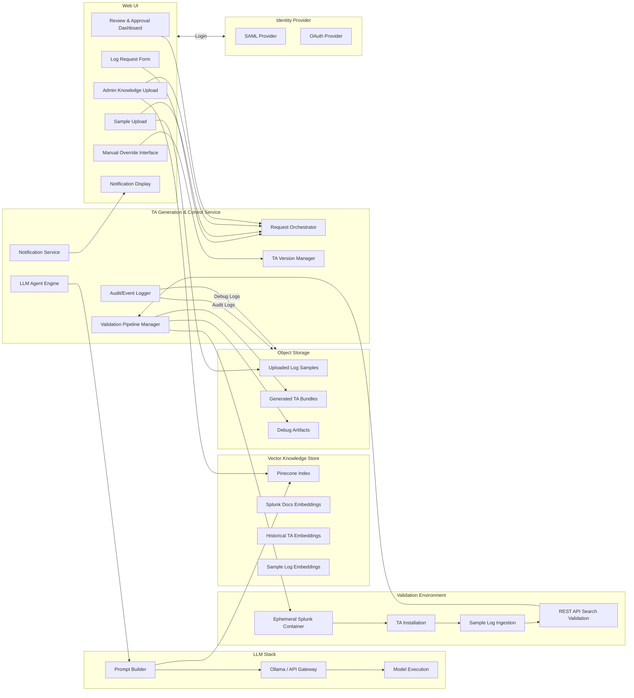

# **System Architecture Diagram (Mermaid)**

---

# **Legend**

| Component                | Purpose                                 |
| ------------------------ | --------------------------------------- |
| **Web UI**               | Requestor + Admin interaction           |
| **Backend Orchestrator** | Controls full workflow / state          |
| **LLM Engine**           | Generates TA configs + extraction logic |
| **Vector DB**            | Stores Splunk knowledge embeddings      |
| **Sandbox**              | Runs Splunk and validates ingestion     |
| **Storage**              | Holds samples, TA bundles, debug logs   |
| **Auth**                 | Provides SAML + OAuth login             |

---

# **Key Architectural Behaviors**

### 🔹 Request Flow

1. Request submitted via UI
2. Backend orchestrator validates inputs
3. Human approval required before generation
4. LLM agent retrieves embeddings from Pinecone
5. TA generated + versioned
6. Sandbox launched → TA tested → Result + debug artifacts stored
7. Requestor notified of success or failure

---

### 🔹 Manual Override Path

* Expert downloads TA
* Edits configs manually
* Re-uploads to UI
* Backend re-runs *only validation stage*
* New version tagged

---

### 🔹 Compliance Behaviors

* All human actions logged
* Log sample retention toggle (store vs auto-delete)
* Maximum parallel Splunk containers configurable
* Internet access restricted via whitelist/blacklist
