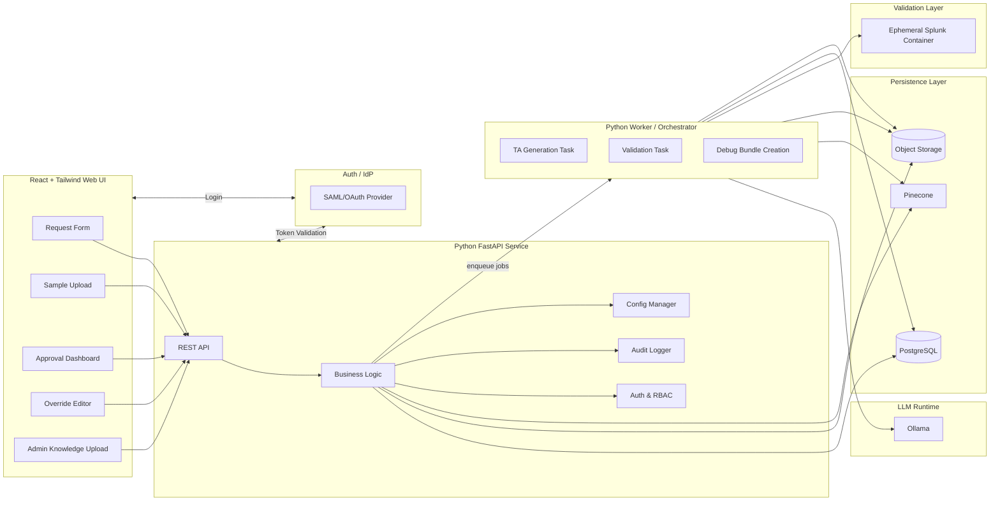

Here’s a **detailed technical design document** based on the PRD, using **Python backend** and **React + Tailwind CSS frontend**.

You can drop this straight into your repo as `DESIGN.md` or similar.

---

# Detailed Design – AI-Assisted Splunk TA Generator

## 1. Overview

This system automates the onboarding of new log sources into Splunk by:

1. Allowing users to submit requests and upload log samples.
2. Using an LLM (via Ollama) and a vector DB (Pinecone) to propose a Splunk TA.
3. Requiring human approval before generation.
4. Generating a Splunk TA package (inputs, props, transforms, CIM mappings).
5. Validating it inside an ephemeral Splunk container.
6. Supporting manual override and re-validation.
7. Providing audit logging, debug logging, and configurable sample retention.

Technologies are chosen to support:

* Python-centric backend
* React/Tailwind frontend
* Containerized, K8s-friendly deployment
* Clear separation of web/API, AI/RAG, and sandbox orchestration

---

## 2. High-Level Architecture

### 2.1 Component Overview

Main components:

1. **Frontend Web App**

   * React + TypeScript
   * Tailwind CSS
   * Talks to backend via REST/JSON
   * Handles request submission, approvals, manual override, and admin uploads

2. **Backend API Service**

   * Python (FastAPI recommended)
   * Provides REST API endpoints
   * Handles auth/roles, business logic, calls to Ollama and Pinecone, persistence, audit logs

3. **Worker / Orchestrator Service**

   * Python
   * Processes long-running tasks: TA generation, Splunk sandbox validation
   * Runs as separate process/pod (e.g., Celery worker with Redis/RabbitMQ)

4. **Vector Database**

   * Pinecone
   * Stores embeddings: Splunk docs, historical TAs, sample logs, knowledge documents

5. **Relational Database**

   * PostgreSQL (recommended)
   * Stores users, roles, requests, artifacts, audit logs, configuration flags, etc.

6. **Object Storage**

   * S3-compatible store (e.g., MinIO, S3, GCS)
   * Stores:

     * Uploaded log samples (if retention enabled)
     * TA bundles (.tgz)
     * Debug bundles

7. **LLM Runtime**

   * Ollama running internally (configurable host/IP/port)
   * Invoked via HTTP from backend/worker

8. **Splunk Sandbox Environment**

   * Container image: Splunk Enterprise (dev/test license)
   * Orchestrated per validation run:

     * In K8s: Job/Pod
     * In Docker: per-run container
   * TA installed + logs ingested + searches executed via REST API

9. **Auth & Identity Provider**

   * External IdP (Keycloak/Okta/Azure AD/etc.) for SAML/OAuth2/OIDC
   * Backend uses OIDC/JWT for access control
   * Local user mode configurable for dev/test

---

### 2.2 Logical Architecture Diagram (Mermaid)



---

## 3. Technology Choices

### 3.1 Backend

* **Language**: Python 3.11+
* **Framework**: FastAPI

  * High performance, async, OpenAPI auto-gen
* **Task Queue**: Celery (with Redis or RabbitMQ)
* **Database ORM**: SQLAlchemy + Alembic migrations
* **Auth**:

  * Authlib / python-jose for JWT validation
  * Support OIDC for OAuth2/SAML bridging
* **HTTP Client**:

  * `httpx` (async-friendly) for:

    * Ollama API
    * Splunk REST API
    * Pinecone
* **Logging**:

  * Structured logs via `structlog` or stdlib `logging` + JSON formatter

### 3.2 Frontend

* **Language**: TypeScript
* **Framework**: React
* **Build Tool**: Vite or CRA (Vite recommended)
* **Styling**: Tailwind CSS
* **State Management**: React Query or Redux Toolkit
* **Auth**:

  * OIDC client (e.g., `oidc-client-ts`) or simple JWT handling via backend session

### 3.3 Data Storage

* **Relational Database**: PostgreSQL
* **Object Storage**: S3-compatible (MinIO for dev)
* **Vector Database**: Pinecone

### 3.4 LLM Runtime

* **Ollama**:

  * HTTP endpoint configurable via environment variables:

    * `OLLAMA_HOST`
    * `OLLAMA_PORT`

### 3.5 Container & Orchestration

* **Containers**: Docker images for:

  * Backend
  * Frontend
  * Worker
* **Orchestration**:

  * Kubernetes (preferred) with:

    * Deployments (backend, frontend, worker)
    * Jobs (per Splunk validation run)
    * ConfigMaps/Secrets for config and credentials

---

## 4. Backend Design

### 4.1 Main Services / Modules

1. **API Layer (`api/`)**

   * FastAPI routers grouped by domain:

     * `/auth`
     * `/requests`
     * `/samples`
     * `/ta`
     * `/validation`
     * `/admin/knowledge`
     * `/config`

2. **Domain Logic (`services/`)**

   * `request_service.py`
   * `ta_generation_service.py`
   * `validation_service.py`
   * `knowledge_service.py`
   * `audit_service.py`
   * `auth_service.py`

3. **Persistence (`models/`, `repositories/`)**

   * SQLAlchemy models and repository classes

4. **Integrations (`integrations/`)**

   * `ollama_client.py`
   * `pinecone_client.py`
   * `splunk_sandbox_client.py`
   * `object_storage_client.py`

5. **Tasks (`tasks/`)**

   * Celery tasks:

     * `generate_ta_task`
     * `validate_ta_task`
     * `create_debug_bundle_task`

---

### 4.2 Data Model (Simplified)

Key entities (tables):

* `users`
* `roles` / `user_roles`
* `requests`
* `log_samples`
* `ta_artifacts`
* `ta_revisions`
* `validation_runs`
* `knowledge_documents`
* `audit_logs`
* `system_config`

Example (simplified):

```python
class Request(Base):
    __tablename__ = "requests"

    id = Column(UUID, primary_key=True)
    created_by = Column(UUID, ForeignKey("users.id"))
    status = Column(Enum("NEW", "PENDING_APPROVAL", "APPROVED", "GENERATING_TA",
                         "VALIDATING", "COMPLETED", "FAILED", name="request_status"))
    source_system = Column(String)
    description = Column(Text)
    cim_required = Column(Boolean, default=True)
    created_at = Column(DateTime)
    updated_at = Column(DateTime)

class TARevision(Base):
    __tablename__ = "ta_revisions"

    id = Column(UUID, primary_key=True)
    request_id = Column(UUID, ForeignKey("requests.id"))
    version = Column(Integer)
    storage_key = Column(String)  # S3 key for .tgz
    generated_by = Column(Enum("AUTO", "MANUAL", name="ta_revision_type"))
    created_at = Column(DateTime)

class ValidationRun(Base):
    __tablename__ = "validation_runs"

    id = Column(UUID, primary_key=True)
    request_id = Column(UUID, ForeignKey("requests.id"))
    ta_revision_id = Column(UUID, ForeignKey("ta_revisions.id"))
    status = Column(Enum("QUEUED", "RUNNING", "PASSED", "FAILED", name="validation_status"))
    results_json = Column(JSON)
    debug_bundle_key = Column(String)  # S3 key for debug bundle
    started_at = Column(DateTime)
    completed_at = Column(DateTime)
```

---

### 4.3 Key Backend Flows

#### 4.3.1 Request Creation & Sample Upload

1. Frontend POST `/requests` → basic metadata
2. Backend creates `Request` record (`NEW`)
3. Frontend POST `/requests/{id}/samples` → upload
4. Backend streams sample to object storage:

   * Save reference in `log_samples`
5. Status moves to `PENDING_APPROVAL` once minimal requirements are met

#### 4.3.2 Human Approval Gate

1. Approver queries `/requests?status=PENDING_APPROVAL`
2. Views details (fields, sample info, AI pre-analysis if desired)
3. Calls `/requests/{id}/approve` or `/requests/{id}/reject`
4. `audit_logs` records action
5. On approval:

   * Enqueue `generate_ta_task`

#### 4.3.3 TA Generation (Worker)

`generate_ta_task`:

1. Load `Request`, associated samples
2. Retrieve relevant embeddings from Pinecone
3. Build prompt with:

   * Request metadata
   * Sample schema preview/snippets
   * Retrieved knowledge docs
4. Call Ollama → configs (inputs/props/transforms) + CIM mapping
5. Build TA directory structure
6. Compress to `.tgz`
7. Upload TA to object storage (`ta_artifacts`/`ta_revisions`)
8. Enqueue `validate_ta_task`

#### 4.3.4 Validation (Worker)

`validate_ta_task`:

1. Check concurrency vs `MAX_PARALLEL_VALIDATIONS`
2. Start Splunk container/K8s Job:

   * Mount TA package
   * Ingest sample logs
3. Run HTTP queries to Splunk REST API:

   * E.g., `search index="<test_index>" | stats count by <expected_fields>`
4. Collect results and categorize as PASS/FAIL
5. On failure:

   * Collect Splunk logs, config files
   * Bundle as debug `.zip` and upload to object storage
   * Save `debug_bundle_key` to `validation_runs`
6. Update `requests.status` → `COMPLETED` or `FAILED`
7. Trigger notification via `notification_service`

#### 4.3.5 Manual Override

1. Engineer downloads TA from `/ta/{request_id}/revisions/{version}`
2. Edits locally
3. Uploads via `/ta/{request_id}/override` (new TARevision with `generated_by=MANUAL`)
4. Backend enqueues `validate_ta_task` pointing to new revision
5. Validation pipeline repeats

---

## 5. Frontend Design

### 5.1 Tech Stack Summary

* React (TypeScript)
* Tailwind CSS
* React Router (multi-page)
* React Query (API calls & caching)
* Component library: custom + headless (e.g., Headless UI)

### 5.2 Pages / Views

1. **Login / Auth Callback**

   * Handles SAML/OAuth/local login flow
2. **Requestor Dashboard**

   * Create new request
   * List own requests + status + download TA
3. **New Request Wizard**

   * Step 1: Basic metadata (source system, description)
   * Step 2: Upload sample(s)
   * Step 3: Summary view
4. **Approver Dashboard**

   * List `PENDING_APPROVAL` requests
   * Detail view + approve/reject actions
5. **TA Detail View**

   * Latest TA version
   * Validation history
   * Links to debug bundle (if failure)
6. **Manual Override Screen**

   * Upload new TA `.tgz`
   * Shows version history
7. **Admin Knowledge Management**

   * Upload docs (PDF, .md, TA bundles)
   * List & manage knowledge entries
8. **Admin Settings**

   * Sample retention toggle
   * `MAX_PARALLEL_VALIDATIONS`
   * Whitelist/blacklist domains (UI for config)

### 5.3 UI Component Structure (Examples)

* `components/forms/RequestForm.tsx`
* `components/requests/RequestList.tsx`
* `components/requests/RequestStatusBadge.tsx`
* `components/approvals/ApprovalCard.tsx`
* `components/ta/TARevisionList.tsx`
* `components/ta/ValidationResultTable.tsx`
* `components/admin/KnowledgeUploadForm.tsx`
* `components/admin/ConfigToggle.tsx`

Tailwind for layout:

* Use a base layout with sidebar (for navigation) and content pane.
* Use utility classes for responsive behavior, e.g.: `flex`, `grid`, `p-4`, `rounded`, `shadow`.

---

## 6. AI & RAG Design

### 6.1 Prompt Construction (High-Level)

Inputs to the prompt:

* Request metadata (what logs, from where)
* Sample log snippets (not full 500MB; sampled lines)
* Relevant Splunk doc excerpts from Pinecone (props, transforms, CIM docs, similar TAs)
* Internal guidelines (e.g., always prefer CIM compliance where possible)

Prompt will instruct the model to:

* Propose `inputs.conf`, `props.conf`, `transforms.conf`
* Suggest CIM mappings (data model + fields)
* Respect Splunk config syntax
* Return outputs in a structured JSON format so backend can assemble files safely

### 6.2 Pinecone Usage

* Index types:

  * `splunk_docs_index`
  * `ta_examples_index`
  * `sample_logs_index` (if needed for clustering)
* On TA generation:

  * Use request description and sample preview as queries
  * Retrieve top-N documents
  * Include them in context for LLM

---

## 7. Splunk Sandbox Orchestration

### 7.1 Container Strategy

**Option (likely)**: Kubernetes Job per validation run.

* Job spec:

  * Image: `splunk/splunk:latest` (or pinned)
  * Environment:

    * License acceptance
    * Admin credentials
  * Volumes:

    * TA `.tgz` + sample logs mounted via an init container or sidecar, or downloaded at start
* Startup script:

  * Install TA
  * Start Splunk
  * Use REST API & CLI to:

    * Ingest logs into a test index
    * Run searches
  * Write validation result file to shared volume

The worker queries job logs or polls a sidecar endpoint to get results, then tears down.

**Non-K8s**: Use Docker SDK from the worker to start/stop containers.

### 7.2 Validation Logic

* Expected checks:

  * Logs indexed with no errors
  * Key fields extracted (timestamp, host/source/sourcetype, CIM-relevant fields)
  * Optional: baseline search (e.g., `index=test | head 10`) returns rows
* Results captured as JSON:

  ```json
  {
    "status": "PASSED",
    "field_coverage": {
      "timestamp": true,
      "host": true,
      "source": true,
      "cim_http_status": false
    },
    "errors": []
  }
  ```

---

## 8. Audit, Logging, and Config

### 8.1 Audit Logging

* Table `audit_logs` with:

  * `id`
  * `user_id`
  * `action`
  * `entity_type`
  * `entity_id`
  * `timestamp`
  * `details` (JSON)
* All human actions log through `audit_service.log_action(...)`

### 8.2 Debug Logging

* Structured logs for:

  * Each API call (with correlation ID)
  * Each task step (generation, validation stages)
* Configured log level via env var

### 8.3 Configuration

* Stored in `system_config` table and env variables, e.g.:

  * `SAMPLE_RETENTION_ENABLED`
  * `MAX_PARALLEL_VALIDATIONS`
  * `ALLOWED_WEB_DOMAINS`
  * `OLLAMA_HOST`, `OLLAMA_PORT`
  * `PINECONE_API_KEY`, `PINECONE_ENV`

---

## 9. Security Considerations

* All external HTTP calls respect whitelist/blacklist domain config.
* Uploaded logs:

  * Never leave on-prem environment
  * Optional automatic deletion after completion if retention disabled
* Credentials:

  * Stored as K8s secrets or .env for non-prod
* LLM prompts:

  * Avoid logging raw samples in plain text in production logs.

---

If you’d like, I can next:

* Turn this into a **sequence diagram** for key flows (request → generation → validation → notify), or
* Provide a **proposed FastAPI route structure** and sample OpenAPI skeleton, or
* Sketch **Kubernetes manifests layout** (Namespaces, Deployments, Jobs, Secrets, ConfigMaps).
