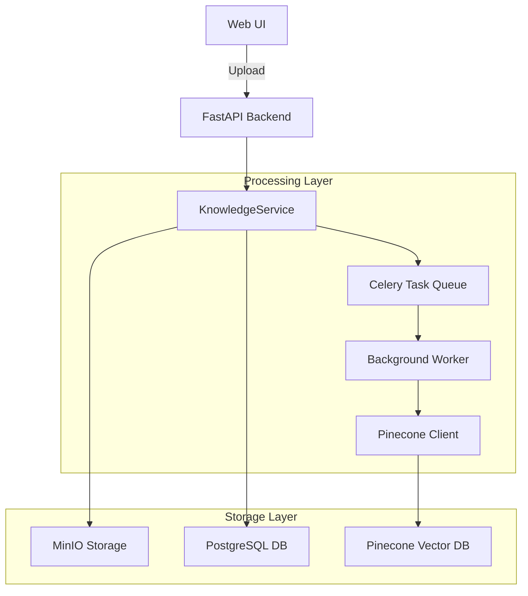

# Knowledge Management System - Documentation

## Overview

The Knowledge Management System enables administrators and knowledge managers to upload, organize, and manage knowledge documents that power the RAG (Retrieval-Augmented Generation) capabilities of the Splunk TA Generator. The system automatically indexes documents into Pinecone vector database for semantic search and retrieval during TA generation.

### Supported Document Types

- **PDF Documents** - Splunk documentation, vendor log format guides, technical specifications
- **Markdown Files** - Internal documentation, best practices, CIM field mappings
- **TA Archives** - Historical Technology Add-ons (.tgz/.tar.gz) for reference implementations

### Key Features

- Drag-and-drop file upload with progress tracking
- Automatic text extraction and vector embedding
- Background indexing via Celery workers
- Role-based access control (ADMIN and KNOWLEDGE_MANAGER roles)
- Document search and filtering
- Soft delete with audit trail
- Re-indexing capabilities for updated models

## Architecture

### System Components



### Document Processing Flow

1. **Upload** - Document uploaded via multipart form to `/api/v1/admin/knowledge/upload`
2. **Storage** - File streamed to MinIO bucket `knowledge-documents`
3. **Database Record** - KnowledgeDocument created with metadata (initially `pinecone_indexed=false`)
4. **Background Task** - Celery task `index_knowledge_document` queued
5. **Text Extraction** - Document parsed based on type (PyPDF2 for PDFs, direct for Markdown, tarfile for archives)
6. **Embedding Generation** - Text chunked and embedded using sentence-transformers
7. **Vector Storage** - Embeddings stored in appropriate Pinecone index
8. **Status Update** - Document marked as indexed with embedding count

### Components

- **KnowledgeService** (`backend/services/knowledge_service.py`) - Core business logic for document lifecycle
- **KnowledgeDocumentRepository** (`backend/repositories/knowledge_document_repository.py`) - Database operations
- **PineconeClient** (`backend/integrations/pinecone_client.py`) - Vector database integration
- **ObjectStorageClient** (`backend/integrations/object_storage_client.py`) - MinIO file storage
- **Celery Task** (`backend/tasks/index_knowledge_task.py`) - Asynchronous indexing worker

## API Endpoints

### Upload Document
```bash
POST /api/v1/admin/knowledge/upload
Content-Type: multipart/form-data

# Fields:
# - file: Document file (required)
# - title: Document title (required, max 500 chars)
# - description: Optional description
# - document_type: pdf|markdown|ta_archive
# - extra_metadata: JSON string with additional metadata

# Example:
curl -X POST http://localhost:8000/api/v1/admin/knowledge/upload \
  -H "Authorization: Bearer $TOKEN" \
  -F "file=@splunk_docs.pdf" \
  -F "title=Splunk Platform Documentation" \
  -F "document_type=pdf" \
  -F "description=Official Splunk documentation for props.conf and transforms.conf"
```

### List Documents
```bash
GET /api/v1/admin/knowledge?skip=0&limit=50&document_type=pdf&search=splunk

# Query Parameters:
# - skip: Pagination offset (default: 0)
# - limit: Page size (default: 50, max: 100)
# - document_type: Filter by type (optional)
# - search: Search in title/description (optional)
```

### Get Document Details
```bash
GET /api/v1/admin/knowledge/{document_id}
```

### Delete Document (Soft Delete)
```bash
DELETE /api/v1/admin/knowledge/{document_id}
```

### Trigger Re-indexing
```bash
POST /api/v1/admin/knowledge/{document_id}/reindex
```

### Get Statistics
```bash
GET /api/v1/admin/knowledge/statistics

# Response:
{
  "by_type": {
    "pdf": 10,
    "markdown": 5,
    "ta_archive": 3
  },
  "indexing_status": {
    "indexed": 15,
    "unindexed": 3
  }
}
```

### Get Download URL
```bash
GET /api/v1/admin/knowledge/{document_id}/download

# Response:
{
  "download_url": "https://...",
  "expires_in": 3600
}
```

## Frontend Usage

### Accessing the Knowledge Management UI

1. Navigate to `/admin/knowledge` in your browser
2. Login with an account that has ADMIN or KNOWLEDGE_MANAGER role
3. The interface provides three main sections:
   - Upload Form
   - Document List
   - Statistics Dashboard

### Uploading Documents

1. **Select Document Type** - Choose PDF, Markdown, or TA Archive
2. **Drag & Drop or Browse** - Upload your file (max size configured via MAX_SAMPLE_SIZE_MB)
3. **Enter Metadata**:
   - Title (required) - Descriptive name for the document
   - Description (optional) - Additional context
   - Extra Metadata (optional) - JSON object with custom fields
4. **Click Upload** - Progress bar shows upload status
5. **Background Indexing** - Document appears in list with "Indexing..." status

### Managing Documents

#### Search and Filter
- Use the search box to find documents by title or description
- Filter by document type using the dropdown
- Results update in real-time

#### Document Actions
- **Download** - Generate a presigned URL for direct download
- **Reindex** - Re-process document (useful after embedding model updates)
- **Delete** - Soft delete (document marked inactive, audit logged)

#### Status Indicators
- 🟢 **Indexed** - Shows embedding count (e.g., "Indexed (245 chunks)")
- 🟡 **Indexing...** - Background processing in progress
- ⚪ **Inactive** - Soft-deleted documents

## Configuration

### Environment Variables

```bash
# MinIO/S3 Storage
MINIO_BUCKET_KNOWLEDGE=knowledge-documents

# Pinecone Indexes
PINECONE_INDEX_DOCS=splunk-docs-index      # For PDF and Markdown
PINECONE_INDEX_TAS=ta-examples-index       # For TA archives

# Processing Configuration
MAX_SAMPLE_SIZE_MB=500                     # Maximum file size
CHUNK_SIZE_WORDS=300                       # Text chunk size for embedding
CHUNK_OVERLAP_WORDS=50                     # Overlap between chunks

# Embedding Model
EMBEDDING_MODEL_NAME=sentence-transformers/all-mpnet-base-v2
EMBEDDING_BATCH_SIZE=32
```

### Pinecone Index Configuration

The system uses two separate indexes based on document type:

| Document Type | Index Name | Purpose |
|--------------|------------|---------|
| PDF | splunk-docs-index | Splunk platform documentation, vendor guides |
| Markdown | splunk-docs-index | Internal docs, best practices |
| TA Archive | ta-examples-index | Historical TA implementations |

Each index should be configured with:
- Dimension: 768 (for all-mpnet-base-v2 model)
- Metric: Cosine similarity
- Cloud/Region: Based on deployment (e.g., aws/us-east-1)

## Document Processing Details

### PDF Processing
```python
# Uses PyPDF2 to extract text from all pages
# Handles encrypted PDFs with empty password attempt
# Concatenates text from all pages
# Gracefully handles corrupted pages
```

### Markdown Processing
```python
# Direct UTF-8 text extraction
# Preserves formatting for better context
# No special preprocessing required
```

### TA Archive Processing
```python
# Extracts using tarfile module
# Focuses on configuration files:
  - inputs.conf
  - props.conf
  - transforms.conf
  - README files
# Concatenates relevant content with file markers
```

### Text Chunking Strategy
- Chunks of 300 words with 50-word overlap
- Preserves sentence boundaries when possible
- Maintains context across chunk boundaries
- Metadata preserved for all chunks (parent_doc_id)

## Troubleshooting

### Common Issues and Solutions

#### Upload Fails
```bash
# Check file size
ls -lh your_file.pdf  # Should be < MAX_SAMPLE_SIZE_MB

# Verify MinIO connection
curl http://localhost:9000/minio/health/live

# Check bucket exists
mc ls minio/knowledge-documents
```

#### Indexing Stuck
```bash
# Check Celery worker logs
docker logs splunk-ta-celery-worker

# Verify Pinecone API key
echo $PINECONE_API_KEY

# Monitor task queue
celery -A backend.tasks.celery_app inspect active
```

#### PDF Parsing Errors
```python
# Encrypted PDFs without known password cannot be processed
# Solution: Decrypt PDF before upload or provide unencrypted version

# Corrupted PDFs may partially extract
# Solution: Repair PDF using external tools before upload
```

#### Search Not Finding Documents
```bash
# Verify document is indexed
GET /api/v1/admin/knowledge/{document_id}
# Check pinecone_indexed field

# Confirm Pinecone index exists
pinecone list_indexes

# Check embedding count > 0
# If 0, document may have had extraction issues
```

## Development

### Adding New Document Types

1. **Update Schema** (`backend/schemas/knowledge.py`):
```python
document_type: Literal["pdf", "markdown", "ta_archive", "new_type"]
```

2. **Add Parser** (`backend/services/knowledge_service.py`):
```python
def _parse_new_type(self, content: bytes) -> str:
    # Implementation for new document type
    return extracted_text
```

3. **Update Validation** (`backend/api/admin/knowledge.py`):
```python
# Add file extension validation for new type
```

4. **Frontend Support** (`frontend/src/types/knowledge.ts`):
```typescript
export type KnowledgeDocumentType = 'pdf' | 'markdown' | 'ta_archive' | 'new_type';
```

### Testing

#### Unit Tests
```python
# Test document parsing
def test_parse_pdf_document():
    service = KnowledgeService(...)
    content = read_test_pdf()
    text = service.parse_document(content, "pdf", "test.pdf")
    assert len(text) > 0

# Test upload flow
async def test_upload_document():
    document = await service.upload_document(...)
    assert document.pinecone_indexed == False
```

#### Integration Tests
```python
# Test end-to-end upload and indexing
async def test_knowledge_document_indexing():
    # Upload document
    response = client.post("/api/v1/admin/knowledge/upload", ...)

    # Wait for indexing
    await wait_for_indexing(document_id)

    # Verify indexed
    doc = client.get(f"/api/v1/admin/knowledge/{document_id}")
    assert doc["pinecone_indexed"] == True
```

## Security

### Role-Based Access Control
- **ADMIN** - Full access to all knowledge management features
- **KNOWLEDGE_MANAGER** - Upload, manage, and delete documents
- Other roles - No access to knowledge management endpoints

### Audit Logging
All actions are logged with:
- User identity (ID and username)
- Action type (UPLOAD, DELETE, UPDATE)
- Resource details (document ID, title)
- Timestamp
- Client IP address

Example audit log entry:
```json
{
  "user_id": "uuid",
  "action": "KNOWLEDGE_UPLOAD",
  "resource_type": "KnowledgeDocument",
  "resource_id": "document_uuid",
  "details": {
    "title": "Splunk Documentation",
    "document_type": "pdf",
    "file_size": 1048576
  },
  "timestamp": "2024-01-01T12:00:00Z"
}
```

### File Validation
- Extension must match document type
- File size limited by MAX_SAMPLE_SIZE_MB
- Content-Type header validated
- Malformed files rejected during parsing

### Storage Isolation
- Dedicated MinIO bucket (knowledge-documents)
- Unique storage keys with UUID prefixes
- No direct file system access
- Presigned URLs expire after 1 hour

## Performance Considerations

### Optimization Tips

1. **Batch Processing** - Upload multiple documents, let background workers process in parallel
2. **Index Selection** - Use appropriate indexes to minimize search space
3. **Chunk Size** - Balance between context preservation and query performance
4. **Worker Scaling** - Increase Celery workers for faster indexing
5. **Caching** - Frontend caches document list with 10-second refresh

### Resource Requirements

| Component | Recommendation |
|-----------|----------------|
| Celery Workers | 2-4 workers for knowledge indexing queue |
| PostgreSQL | Index on document_type, created_at |
| MinIO | 10GB+ storage for documents |
| Pinecone | Standard plan or higher for production |

## Future Enhancements

### Planned Features

1. **Batch Upload** - Upload multiple documents in single operation
2. **Document Versioning** - Track changes and maintain history
3. **Full-Text Search** - PostgreSQL FTS in addition to vector search
4. **Automatic Re-indexing** - Trigger when embedding model changes
5. **Retention Policies** - Automatic archival of old documents
6. **Preview Generation** - Thumbnail/preview for uploaded documents
7. **Tags and Categories** - Enhanced organization and filtering
8. **Usage Analytics** - Track which documents are retrieved most often
9. **Import from URLs** - Direct import from documentation websites
10. **Export/Backup** - Bulk export of documents and metadata

### Integration Opportunities

- **CI/CD Pipeline** - Auto-upload documentation on changes
- **Slack/Teams** - Notifications for new documents
- **Confluence/Wiki** - Import from existing knowledge bases
- **GitHub** - Auto-index README files from repositories

## Support

For issues or questions about the Knowledge Management System:
1. Check this documentation
2. Review system logs
3. Contact system administrator
4. File issue in project repository

---

*Last Updated: Implementation of Knowledge Management System for RAG*